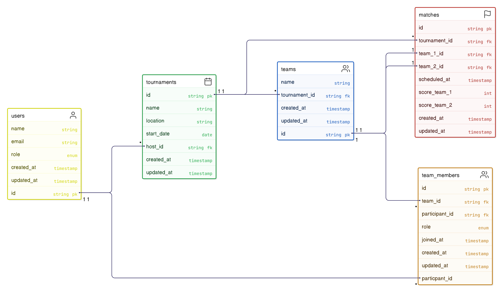

# TournamentManagementSystem

## ER Diagram

Here is the ER diagram for the project:

=======
# README

🏆 Tournament Management System
This is a Tournament Management System built with Ruby on Rails and PostgreSQL. It allows users to create, manage tournaments with role-based authentication and authorization using Pundit and JWT for secure user authentication.

* Ruby Version
    Ruby 3.4.1
    Rails 8.0.1

* System dependencies
    PostgreSQL - Database

## 🚀 **Tech Stack**
| Tech             | Description                              |
|------------------|------------------------------------------|
| **Ruby**          | Programming language                     |
| **Rails**          | Backend framework                        |
| **PostgreSQL**     | Database                                  |
| **Pundit**         | Authorization                             |
| **JWT**            | User authentication                      |
| **Tailwind CSS**    | Styling                                  |

## **Installlation Steps**

1.Clone repository
git clone git@github.com:RushiSelldo/TournamentManagementSystem.git
cd tournament-management-system

2.Install Bundler
Install the bundler gem if not already installed:
gem install bundler

3.Install Dependencies
Install all project dependencies:
bundle install

4.Set Up Database
Create and set up the database:
rails db:migrate

5.Start the server:
rails server

6.Run application
http://localhost:3000

## **👤 User Roles**
Admin – Can create and manage all tournaments.
Organizer – Can create and manage their own tournaments.
Participant – Can register for tournaments and view schedules.

## **Features**
✔️ User signup and login with JWT authentication
✔️ Role-based access control with Pundit
✔️ Tournament creation and management
✔️ Registration for tournaments
✔️ Matches creation and management